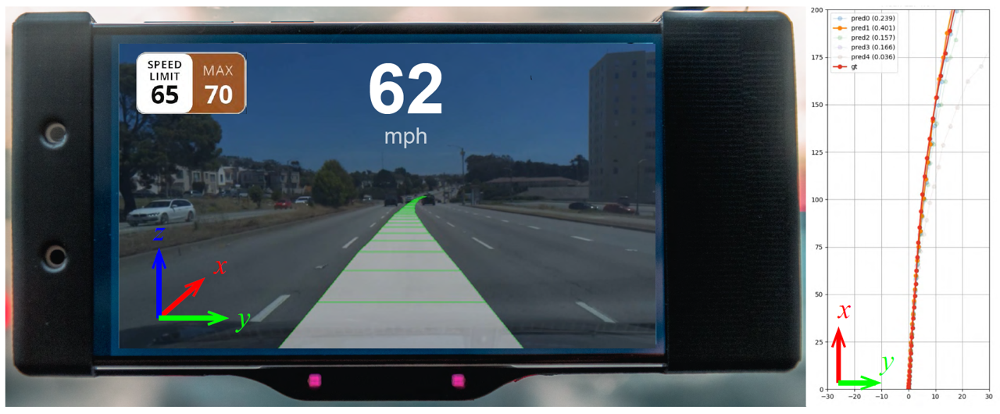

# <p align="center">Openpilot-Deepdive</p>
**<p align="center">Level 2 Autonomous Driving on a Single Device: Diving into the Devils of Openpilot</p>**

[**Webpage**](https://sites.google.com/view/openpilot-deepdive/home) | [**Paper**](https://arxiv.org/abs/2206.08176) | [**Zhihu**](https://www.zhihu.com/people/PerceptionX)
***
# Introduction

This repository is the PyTorch implementation for our Openpilot-Deepdive.
In contrast to most traditional autonomous driving solutions where the perception, prediction, and planning module are apart, [Openpilot](https://github.com/commaai/openpilot) uses an end-to-end neural network to predict the trajectory directly from the camera images, which is called Supercombo. We try to reimplement the training details and test the pipeline on public benchmarks. Experimental results of OP-Deepdive on nuScenes, Comma2k19, CARLA, and in-house realistic scenarios (collected in Shanghai) verify that a low-cost device can indeed achieve most L2 functionalities and be on par with the original Supercombo model. We also test on CommaTwo device with a dual-model deploeyment framework, which is in this repo: [Openpilot-Deployment](https://github.com/OpenPerceptionX/Openpilot-Deepdive/tree/deploy/Openpilot-Deployment).

* [Directory Structure](#directory-structure) 
* [Changelog](#changelog) 
* [Quick Start](#quick-start-examples) 
    * [Installation](#installation)
    * [Dataset](#dataset)
    * [Training and Testing](#training-and-testing)
    * [Demo](#demo)
* [Baselines](#baselines)
* [Citation](#citation) 
* [License](#license)  

***
# Directory Structure

```
Openpilot-Deepdive 
├── tools           - Tools to generate split on Comma2k19 and nuScenes datasets.  
├── utils_comma2k19 - The utils provided by comma, copied from `commaai/comma2k19.git/utils`
├── data
      ├── nuscenes  -> soft link to the nusSenes-all dataset
      ├── comma2k19 -> soft link to the Comma2k19 dataset
```
***
# Changelog

2022-6-17: We released the v1.0 code for Openpilot-Deepdive.

2022-6-26: We fix some problems and update the readme for using the code on bare-metal machines. Thanks @EliomEssaim and @MicroHest!

2022-7-13: We released the v1.0 code for [Openpilot-Deployment](https://github.com/OpenPerceptionX/Openpilot-Deepdive/tree/deploy/Openpilot-Deployment) for dual-model deployment in the Openpilot framework.

***
# Quick Start Examples
Before starting, we refer you to read the [arXiv](https://arxiv.org/abs/2206.08176) to understand the details of our work.
## Installation
Clone repo and install requirements.txt in a [Python>=3.7.0](https://www.python.org/) environment, including [PyTorch>=1.7](https://pytorch.org/get-started/locally/).

```
git clone https://github.com/OpenPerceptionX/Openpilot-Deepdive.git  # clone
cd Openpilot-Deepdive
pip install -r requirements.txt  # install
```
## Dataset
We train and evaluate our model on two datasets, [nuScenes](https://www.nuscenes.org/nuscenes) and [Comma2k19](https://github.com/commaai/comma2k19).
The table shows some key features of them.

| Dataset     | Raw<br>FPS (Hz)  | Aligned&<br>FPS (Hz) | Length Per<br>Sequence<br>(Frames/Second) | Altogether<br>Length<br>(Minutes) | Scenario | Locations |
| :----:     |:----:|:----:|:----:|:----:|:----:|:----:|
| nuScenes | 12 | 2 | 40 / 20 | 330 | Street | America<br>Singapore |  
| Comma2k19  | 20 | 20 | 1000 / 60 | 2000 | Highway | America | 

Please create a `data` folder and create soft links to the datasets.

For dataset splits, you may create your own by running the scripts in the `tools` folder, or download it in https://github.com/OpenPerceptionX/Openpilot-Deepdive/issues/4.

## Training and Testing
By default, the batch size is set to be 6 per GPU, which consumes 27 GB GPU memory. When using 8 V100 GPUs, it takes approximate 120 hours to train 100 epochs on Comma2k19 dataset. 

**Note**: Our lab use `slurm` to run and manage the tasks. Then, the PyTorch distributed training processes are initialized manually by `slurm`, since the automatic `mp.spawn` may cause unknown problems on slurm clusters. For most people who do not use a cluster, it's okay to launch the training process on bare-metal machines, but you will have to open multiple terminals and set some environmental variables manually if you want to use multiple GPUs. We will explain it below.

**Warning**: Since we have to extract all the frames from the video before sending them into the network, the program is hungry for memory. The actual memory usage is related to `batch_size` and `n_workers`. By default, each process with `n_workers=4` and `batch_size=6` consumes around 40 to 50 GB memory. You'd better open an `htop` to monitor the memory usage, before the machine hangs.

```[bash]
# Training on a slurm cluster
export DIST_PORT = 23333  # You may use whatever you want
export NUM_GPUS = 8
PORT=$DIST_PORT$ srun -p $PARTITION$ --job-name=openpilot -n $NUM_GPUS$ --gres=gpu:$NUM_GPUS$ --ntasks-per-node=$NUM_GPUS$ python main.py
```

```[bash]
# Training on a bare-metal machine with a single GPU
PORT=23333 SLURM_PROCID=0 SLURM_NTASKS=1 python main.py
```

```[bash]
# Training on a bare-metal machine with multiple GPUs
# You need to open multiple terminals

# Let's use 4 GPUs for example
# Terminal 1
PORT=23333 SLURM_PROCID=0 SLURM_NTASKS=4 python main.py
# Terminal 2
PORT=23333 SLURM_PROCID=1 SLURM_NTASKS=4 python main.py
# Terminal 3
PORT=23333 SLURM_PROCID=2 SLURM_NTASKS=4 python main.py
# Terminal 4
PORT=23333 SLURM_PROCID=3 SLURM_NTASKS=4 python main.py
# Then, the training process will start after all 4 processes are launched.
```

By default, the program will not output anything once the training process starts, for the widely-used `tqdm` might be buggy on slurm clusters. So, you may see some debugging info like the one below and the program seems to be stuck.

```
[1656218909.68] starting job... 0 of 1
[1656218911.53] DDP Initialized at localhost:23333 0 of 1
Comma2k19SequenceDataset: DEMO mode is on.
Loaded pretrained weights for efficientnet-b2
```

Don't worry, you can open a tensorboard to see the loss and validation curves.
```
tensorboard --logdir runs --bind_all
```

Otherwise, you may want to parse `--tqdm=True` to show the progress bar in `Terminal 1`.

By default, the test process will be executed once every epoch. So we did not implement the independent test script.

## Demo
See more demo and test cases on our [webpage](https://sites.google.com/view/openpilot-deepdive/home)！

You can generate your own demo video using `demo.py`. It will generate some frames in the `./vis` folder. (You may have to create it first.) Then, you can generate a video using `ffmpeg`.

https://user-images.githubusercontent.com/20351686/174319920-35b3ad34-a15e-43d7-be23-b135c24712e2.mp4


***
# Baselines
Here we list several baselines to perform trajectory prediction task on different datasets. You are welcome to pull request and add your work here!

**nuScenes**
| Method                | AP@0.5(0-10)  | AP@1(10-20) | AP@1(20-30) | AP@1(30-50) |
| :----:                |:----:         |:----:       |:----:       |:----:       |
| Supercombo            | 0.237         | 0.064       | 0.038       | 0.053       |
| Supercombo-finetuned  | 0.305         | 0.162       | 0.088       | 0.050       |
| OP-Deepdive (Ours)    | 0.28          | 0.14        | 0.067       |  0.038      |

**Comma2k19**
| Method                | AP@0.5(0-10)  | AP@1(10-20) | AP@1(20-30) | AP@1(30-50) | AP@2(50+) | Average Jerk* |
| :----:                |:----:         |:----:       |:----:       |:----:       |:----:     |:----:         |
| Supercombo            | 0.7966        | 0.6170      | 0.2661      | 0.0889      |  0.0062   |  2.2243       |
| OP-Deepdive (Ours)    | 0.909         | 0.808       |  0.651      | 0.465       |  0.239    |  4.7959       | 

\*: The lower, the better. To comparison, the average jerk of human driver's trajectories is  0.3232 m/s^2.

***
# Citation
Please use the following citation when referencing our repo or [arXiv](https://arxiv.org/abs/2206.08176).
```
@article{chen2022op,
   title={Level 2 Autonomous Driving on a Single Device: Diving into the Devils of Openpilot},
   author={Li Chen and Tutian Tang and Zhitian Cai and Yang Li and Penghao Wu and Hongyang Li and Jianping Shi and Junchi Yan and Yu Qiao},
   journal={arXiv preprint arXiv:2206.08176},
   year={2022}
}
```
***
# License
All code within this repository is under [Apache License 2.0](https://www.apache.org/licenses/LICENSE-2.0).
***

